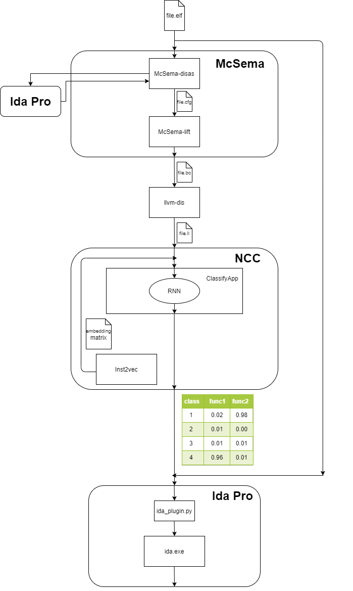

# Based on https://github.com/spcl/ncc

```ncc``` (Neural Code Comprehension) is a general Machine Learning technique to learn semantics from raw code in virtually any programming language. It relies on ```inst2vec```, an embedding space and graph representation of LLVM IR statements and their context.



### Requirements
* GNU / Linux or Mac OS
* Python (3.6.5)
* Packages from requirements.txt
* wine
* ida7.2 (installed in wine and configured using manual from scripts/ida_setup.txt)
* mcsema
* llvm-dis

### Running the code

#### 1. Training `inst2vec` embeddings

By default, `inst2vec` will be trained on publicly available code. Some additional datasets are available on demand and you may add them manually to the training data. For more information on how to do this as well as on the datasets in general, see [datasets](data/README.md).

```shell
$ python train_inst2vec.py --helpfull # to see the full list of options
$ python train_inst2vec.py \
>  # --context_width ... (default: 2)
>  # --data ... (default: data/, automatically generated one. You may provide your own)
```

Alternatively, you may skip this step and use [pre-trained embeddings](published_results/emb.p).

#### 2. Evaluating `inst2vec` embeddings

```shell
$ python train_inst2vec.py \
> --embeddings_file ... (path to the embeddings p-file to evaluate)
> --vocabulary_folder ... (path to the associated vocabulary folder)
```

#### 3. Training on tasks with ```ncc``` 

**Algorithm classification**

Task: Classify applications into 104 classes given their raw code.  
Code and classes provided by https://sites.google.com/site/treebasedcnn/ (see [Convolutional neural networks over tree structures for programming language processing](https://arxiv.org/abs/1409.5718))

Train:
```shell
$ python train_task_classifyapp.py --helpfull # to see the full list of options
$ python train_task_classifyapp.py --input_data task/classifyapp --out task/classifyapp \
                                  --maxlen 0 --model_name NCC_classifyapp --inference=False
```

#### 4. Run binary in ida with predicted classes near functions

Works only on linux(x64), don't move this script to directory where exist not empty subdirectory with name tmp. Before run replace path below in file script.sh:
  ida_path - path to ida64.exe
  llvm-dis - path to llvm-dis
  mcsema-lift - path to mcsema-lift
  app - path to folder with train_task_classifyapp.py

Run:
```shell
$ ./script.sh path-to-elf
```

#### 5. Generate dataset of lifted binaries based on POJ-104

#### 5.1 Compile sources and lift them to llvm_ir

Works only on linux(x64).
Download dataset from https://sites.google.com/site/treebasedcnn/, unpack it.

Replace parameters values and run:
```shell
$ python3 scripts/compile_data.py --ir_per_file count_of_files --num_samples count_of_samples \
                      --num_threads 8 --dataset_path path_to_dataset --ida_path path_to_ida \
                      --llvm_dis path_to_llvm_dis --mcsema_lift path_to_mcsema_lift
```
Where
count_of_files - Number of .ll files generated per input with random choice of optimization level
count_of_samples - Number samples choicen from source per class

#### 5.2 Split lifted dataset to train, test, validation

Splitted dataset appears in current directory. If you want change sizes of partitions, replace parts var initialisation in scripts/split_data.py by your values.

Run:
```shell
$ python3 scripts/split_data.py --path path_to_lifted_dataset
```

#### 5.3 Get function names declared in sources

Replace parameters values and run:
```shell
$ python3 scripts/get_function_from_cpp.py --lib_path path_to_clang_library \
                      --path_in path_to_dataset --path_out path_to_place_names
```

#### 5.4 Delete functions that appeared during compilation in sources

Replace parameters values and run:
```shell
$ python3 scripts/del_functions.py --path_funcs path_from_previous_step --num_threads 8 \
                      --path_llvm path_to_lifted_and_splited_dataset
```

#### 6. Train and evaluate on lifted binaries

Firstly complete previous step. Put obtained dataset (folders ir_train, ir_val, ir_test) to task/task_classifyapp_lifted.

Train:
```shell
$ python train_task_classifyapp.py --input_data task/classifyapp_lifted \
                      --out task/classifyapp_lifted --maxlen 1100 \
                      --model_name NCC_classifyapp_lifted --inference=False
```
Where
maxlen - max legth of preproccesed sequence in dataset. More then 90% of sequences have length less or equal then 1100. If 0 specified then it computed dynamically, but its high memory and computationally consuming.

Test obtained model:
```shell
$ python train_task_classifyapp.py --input_data task/classifyapp_lifted \
                      --out task/classifyapp_lifted --maxlen 1100 \
                      --model_name NCC_classifyapp_lifted --inference=True
```

To use obtained model to predict labels for .ll files, put them to inference/ir_test folder and run:
```shell
$ python train_task_classifyapp.py --input_data task/classifyapp_lifted \
                      --out task/classifyapp_lifted --maxlen 1100 \
                      --model_name NCC_classifyapp_lifted --inference=True --input_file name
```
Result is file in json fromat will be located in folder inference with specified name.

## License

NCC is published under the New BSD license, see [LICENSE](LICENSE).